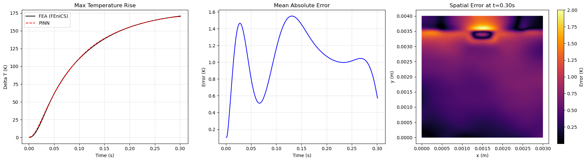
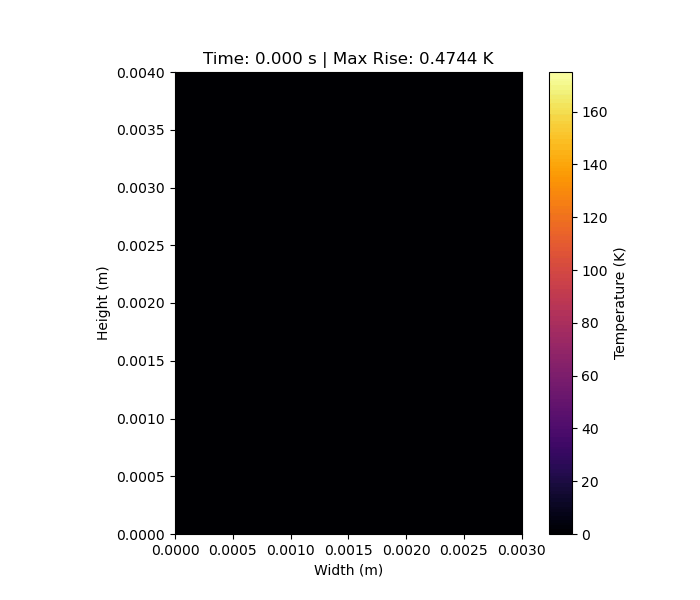

# 2D Thermal Diffusion PINN for Chip Hotspot Prediction

## Repository Link

[https://github.com/fdtroya/2D-Thermal-diffusion-PINN](https://github.com/fdtroya/2D-Thermal-diffusion-PINN)

## Description

This project implements a **Physics-Informed Neural Network (PINN)** to solve the 2D transient heat diffusion equation for electronic chip geometries. The goal is to predict high-gradient temperature rises (up to 170°C) caused by localized power inputs. 

Unlike traditional "black-box" models, this approach embeds the governing partial differential equations (PDEs) directly into the neural network's loss function. This allows for a mesh-free thermal model that strictly respects physical constraints, including adiabatic boundary conditions and initial ambient states, without requiring vast amounts of labeled sensor data.

### Task Type

**Regression / Physics-Informed Machine Learning (SciML)**

### Results Summary

#### Best Model Performance
- **Best Model:** Hybrid Fourier-ResNet PINN (128-width, 4-layers)
- **Evaluation Metric:** Global Mean Absolute Error (MAE) compared to FEniCS FEA ground truth.
- **Final Performance:** **1.5 K (MAE)** across the entire spatio-temporal domain.

#### Model Comparison
- **Ground Truth:** High-fidelity Finite Element Analysis (FEA) baseline via FEniCS.
- **PINN Accuracy:** The model successfully captures the **170°C peak** with high precision, maintaining physical consistency across both the silicon substrate and active heat source regions.
- **Key Metric:** Peak temperature tracking shows minimal "sluggishness," resolving sharp gradients that standard MLPs typically "smear" out during training.

#### Key Insights
- **Most Important Features:** The use of **Sinusoidal Encoders** was critical to overcoming spectral bias, allowing the network to resolve the high-frequency thermal spikes at the heat source.
- **Model Strengths:** Highly stable temporal evolution achieved via **Residual (ResNet) skip-connections** and a $[0, 1]$ time-scaling strategy, which effectively prevented non-physical "cooling" oscillations.
- **Fine-Tuning:** The transition from Adam to **L-BFGS optimization** was essential for closing the final error gap and sharpening the peak temperature profile.
- **Adaptive Training:** To improve training convergence The model was trained first with low PDE loss weight to achieve good BC loss and then trained with a higher PDE loss
- **Model Limitations:** Numerical stiffness increases significantly as material interface transitions (masking) become sharper ($\delta < 1e-3$).
- **Impact:** Demonstrates that PINNs can provide near-instantaneous thermal inference for power electronics, offering a potential real-time alternative to computationally expensive FEA solvers.

## Documentation

1. **[Literature Review](0_LiteratureReview/README.md)**: State-of-the-art in PINNs for thermal management.
2. **[Dataset Characteristics](1_DatasetCharacteristics/exploratory_data_analysis.ipynb)**: Analysis of the FEniCS FEA generated data and coordinate normalization.
3. **[FEA Baseline](2_FEA_baseline/README.md)**: FEniCS simulation setup used for ground truth verification.
4. **[Model Definition and Evaluation](3_Model/model_definition_evaluation.ipynb)**: Implementation of the Hybrid architecture, custom PDE loss, and error metrics.
5. **[Presentation](4_Presentation/README.md)**: Summary of findings and visual results.

## Results

## Cover Image

